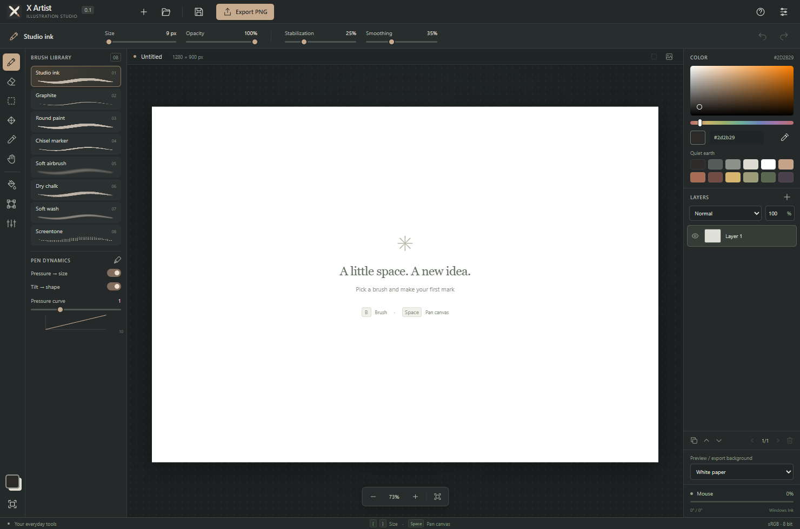

# X Artist

A free, offline illustration studio for artists who want a quieter workspace. X Artist combines a compact gunmetal interface with expressive brushes, tablet dynamics and a straightforward layer workflow.



**Status: 0.1.1 — early preview for Windows x64.** This is a working illustration editor, not a full replacement for Photoshop or Krita. Animation and comic layout tools are future work; the first release prioritizes drawing, selections, transformations and color adjustments.

## Download and run

Download `X-Artist-0.1.1-Windows-x64.exe` from [GitHub Releases](https://github.com/glitchykid/xartist/releases). It is a portable application: no installation, account or subscription is required. The executable is not code-signed. Windows may display an unknown-publisher prompt.

## What works

- Dense, scroll-free controls that fit a 1040 × 720 Windows window, including its title bar. The layer list uses pages, and the shortcut reference uses two columns. All six languages are checked at the minimum size.
- Eight raster brushes: studio ink, graphite, round paint, chisel marker, soft airbrush, dry chalk, soft wash and screentone. Brush previews are rendered with the actual brush engine.
- Brush size, stroke opacity, independent stabilization and smoothing, adjustable pressure curve, and tilt-dependent tip shape. Opacity applies to the whole stroke rather than accumulating to opaque at overlapping dabs.
- Windows Ink pen pressure and tilt through Pointer Events, coalesced input samples, hardware eraser input, mouse drawing and touch panning.
- Raster layers with visibility, locking, opacity, normal/multiply/screen/overlay blending, duplication, reordering, renaming and deletion.
- Memory-bounded undo/redo, rectangular selections, fill/clear, moving selected pixels, scale/rotate/flip, and previewable brightness/contrast/saturation adjustments.
- Eyedropper, HSV color field, HEX input, native color picker and a restrained earth-tone palette.
- Zoom, pan and fit-to-window controls; shortcuts use physical keys and work with Cyrillic keyboard layouts.
- Native save/open dialogs for lossless, multilayer `.xartist` projects. PNG export supports a white or transparent background; PNG/JPEG/WebP import adds an image layer.
- Automatic local recovery copy after edits, explicit session restoration and protection against closing or replacing an unsaved document.
- Complete interface translations: English, Russian, Ukrainian, Korean, Japanese and Simplified Chinese.

## Quick start

1. Choose a brush on the left and draw on the canvas. Adjust size and opacity in the top strip.
2. Increase **Stabilization** to reduce hand jitter. **Smoothing** adds interpolation; higher values add a little cursor lag.
3. Add a layer with **+** in the Layers panel. Double-click a layer name to rename it.
4. Use **M** to select a rectangle, **V** to move its pixels, **Ctrl+T** to transform it, or **Ctrl+U** for color adjustments. Without a selection these commands affect the active layer.
5. Save your editable work with **Ctrl+S**. Export a flattened PNG when you want to share an image.

The white paper is a preview/export background, not a painted layer. Choose **Transparent** in the right panel to see and export transparency. Fill (**G**) fills the entire selected area or layer; it is not a flood-fill bucket.

### Tablet setup

Enable **Windows Ink** in your tablet driver. Hover or draw with the pen to see live pressure and tilt values at the bottom right. Enable **Pressure → size** and **Tilt → shape** under Pen dynamics. The pressure curve below 1 makes light touches stronger; above 1 requires more pressure for the same width.

Pressure and tilt depend on the tablet, pen and driver. Synthetic input tests verify the engine's response, but no physical tablet has been used to certify hardware compatibility. A pen without tilt reporting cannot provide tilt data. Touch input pans rather than paints to reduce accidental marks.

### Shortcuts

| Keys | Action |
| --- | --- |
| B / E | Brush / eraser |
| M / V | Rectangular selection / move pixels |
| I or hold Alt | Eyedropper |
| H or hold Space | Pan |
| Mouse wheel | Zoom around cursor |
| [ / ] | Decrease / increase brush size |
| G / Delete | Fill / clear selection or active layer |
| Ctrl+Z / Ctrl+Shift+Z | Undo / redo |
| Ctrl+N / Ctrl+O / Ctrl+S | New / open / save project |
| Ctrl+Shift+E | Export PNG |
| Ctrl+T / Ctrl+U | Transform / color adjustments |
| Ctrl+D or Escape | Deselect |
| Ctrl+0 / Ctrl+1 | Fit / 100% zoom |
| ? | Shortcut reference |

## Development

Use **Node.js 24 LTS** (24.21.0 or newer in the 24.x line). The initial release pins Electron 44.4.5, TypeScript 7.0.2, Vite 8.3.1, electron-builder 26.15.3 and Playwright 1.63.0. No paid API or generated-image service is needed to build or run the application.

```sh
npm ci
npm run dev          # browser development at http://127.0.0.1:5173
npm start            # build and launch the desktop application
npm test             # 17 browser integration tests; Microsoft Edge must be installed
npm run build
node scripts/desktop-smoke.mjs  # desktop file I/O and isolation checks after building
npm run dist         # portable Windows x64 executable in release/
```

The browser development version downloads files instead of opening native save dialogs. The desktop application is the release target. To validate a packaged build, run `node scripts/desktop-smoke.mjs "release/win-unpacked/X Artist.exe"`.

Tagging `v*` runs the Windows build/test workflow and publishes a GitHub prerelease with the portable executable and SHA-256 checksum. Main-branch changes run the same checks and upload build artifacts.

## Current boundaries

- sRGB, 8-bit raster editing; no PSD import/export, CMYK or ICC color management.
- Maximum side: 4096 px; maximum canvas area: 16 million pixels. Up to 24 layers, also limited to 64 million aggregate layer pixels.
- Undo retains up to 40 actions within an approximate 128 MiB pixel-history budget; at least the latest action is retained. Larger documents use more memory and can pause during snapshots or saving.
- Soft wash is a textured soft raster brush, not a physical watercolor simulation. Brush presets are built in; importing Photoshop brush packs is not supported.
- Rectangular selections only; no lasso, masks, vector paths, editable text, timeline or animation export yet.
- Recovery is a single local copy, not a version archive or cloud backup. Always save important projects as files.
- The portable executable does not install itself, but Electron keeps preferences and recovery data in the user's application-data directory.

See [architecture](docs/ARCHITECTURE.md), [validation](docs/VALIDATION.md), [release notes](docs/RELEASE_NOTES.md) and [asset provenance](docs/ASSETS.md).

## License

MIT. Bundled dependencies retain their respective licenses. The X Artist icon was generated specifically for this project.
